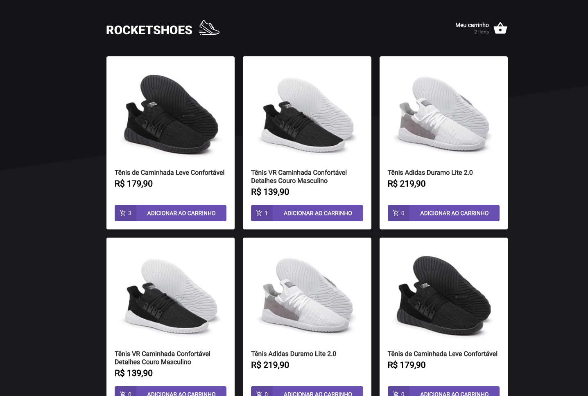

<h1 align="center">
 Desafio 03:  Criando um hook de carrinho de compras - RocketStore
</h1>

<p align="center">
  

  <a href="https://www.linkedin.com/in/luanyata/">
    
  </a>

  

  <a href="https://github.com/luanyata/RocketStore/stargazers">
    
  </a>
</p>

# 💻 Sobre o desafio

Nesse desafio, você deverá criar uma aplicação para treinar o que aprendeu até agora no ReactJS

Essa será uma aplicação onde o seu principal objetivo é criar um hook de carrinho de compras. Você terá acesso a duas páginas, um componente e um hook para implementar as funcionalidades pedidas nesse desafio:

- Adicionar um novo produto ao carrinho;
- Remover um produto do carrinho;
- Alterar a quantidade de um produto no carrinho;
- Cálculo dos preços sub-total e total do carrinho;
- Validação de estoque;
- Exibição de mensagens de erro;
- Entre outros.

A seguir veremos com mais detalhes o que e como precisa ser feito 🚀


## Se preparando para o desafio
---

Para esse desafio, além dos conceitos vistos em aula utilizaremos algumas coisa novas para deixar a nossa aplicação ainda melhor. Por isso, antes de ir diretamente para o código do desafio, explicaremos um pouquinho de:

- Fake API com JSON Server;
- Preservar dados do carrinho com localStorage API;
- Mostrar erros com toastify.

---
### Fake API com JSON Server
---

Assim como utilizamos o MirageJS no módulo 2 para simular uma API com os dados das transações da aplicação dt.money, vamos utilizar o JSON Server para simular uma API que possui as informações dos produtos e do estoque. 

Navegue até a pasta criada, abra no Visual Studio Code e execute os seguintes comandos no terminal:

```bash
yarn
yarn server
```

Dessa forma, basta consumir essas rotas da API normalmente com o axios. Caso queira estudar mais sobre o **JSON Server**, dê uma olhada aqui: [typicode/json-server](https://github.com/typicode/json-server)

---
### __Preservando carrinho com localStorage API__
---
Para preservar os dados do carrinho mesmo se fecharmos a aplicação, utilizaremos a **localStorage API**

Essa é uma API que nos permite persistir dados no navegador em um esquema de chave-valor (semelhante ao que temos com objetos JSON). Como essa é uma API global, você não precisa importar nada antes de usar. 

Para salvar os dados, você deve utilizar o método `setItem`. Como primeiro argumento você deve informar o nome que você quer dar para o registro, no caso desse desafio é `obrigatório` utilizar o nome `@RocketShoes:cart`. Já o segundo argumento é o valor do registro que **obrigatoriamente** precisa estar no formato `string`.  Abaixo segue um exemplo:

```bash
localStorage.setItem('@RocketShoes:cart', cart)
```

Caso queira enviar um valor para o registro que não esteja no formato `string`, é preciso tratá-lo (ex.: `JSON.stringify`). Isso fará com que um objeto, lista, número ou qualquer outro valor seja convertido para uma string.

Para recuperar os dados, você deve utilizar o método `getItem` passando como argumento do registro que, no caso desse desafio, é `obrigatório` utilizar como `@RocketShoes:cart`. Abaixo segue um exemplo:

```jsx
const storagedCart = localStorage.getItem('@RocketShoes:cart');
```

O valor retornado pelo método `getItem` é sempre no formato `string`. Caso você queira utilizar esse dado em outro formato, é preciso tratá-los (ex.: `JSON.parse`). Isso irá converter a informação ao estado original de quando foi salva com o `JSON.strigify`, seja uma lista, um objeto ou outro tipo de dado.

Caso queira estudar mais sobre a **localStorage API**, dê uma olhada aqui [Window.localStorage](https://developer.mozilla.org/pt-BR/docs/Web/API/Window/localStorage)

---
### __Mostrando erros com toastify__
---

Para mostrar os erros em tela, iremos utilizar um lib chamada **react-toastify**. Ela ajuda a mostra informações temporárias e rápidas de uma forma bem bonita.

De todos os métodos, utilizaremos apenas o `error` e será obrigatório utilizar mensagens predefinidas para que os testes passem (veremos mais sobre isso)

Caso queira estudar mais sobre a **react-toastify**, dê uma olhada aqui [fkhadra/react-toastify](https://github.com/fkhadra/react-toastify#readme)

---
### __components/Header/index.tsx__
---
Você deve receber o array `cart` do hook `useCart` e mostrar em tela a quantidade de produtos **distintos** adicionados ao carrinho. Dessa forma, se o carrinho possui 4 unidades do item A e 1 unidade do item B o valor a ser mostrado é `2 itens`.

---
### __pages/Home/index.tsx__
---
Você deve renderizar os produtos buscados da fake API em tela com as informações de título, imagem, preço e quantidade adicionada ao carrinho. Por fim, é preciso implementar a funcionalidade de adicionar o produto escolhido ao carrinho ao clicar no botão `ADICIONAR AO CARRINHO`.

Nesse arquivo, temos três pontos importantes a serem implementados:

- **cartItemsAmount:** Deve possuir as informações da quantidade de cada produto no carrinho. Sugerimos criar um objeto utilizando `reduce` onde a chave representa o id do produto e o valor a quantidade do produto no carrinho. Exemplo: se você possuir no carrinho um produto de id 1 e quantidade 4 e outro produto de id 2 e quantidade 3, o objeto ficaria assim:

```jsx
{
	1: 4,
	2: 3
}
```

- **loadProducts:** Deve buscar os produtos da Fake API e formatar o preço utilizando o helper `utils/format`
- **handleAddProduct:** Deve adicionar o produto escolhido ao carrinho.
---
### __pages/Cart/index.tsx__
---

Você deve renderizar uma tabela com a imagem, título, preço unitário, quantidade de unidades e preço subtotal de cada produto o carrinho. Além disso, também é preciso renderizar o preço total do carrinho. Por fim, é preciso implementar as funcionalidades dos botões de decrementar, incrementar e remover o produto do carinho.

Nesse arquivo, temos cinco pontos importantes a serem implementados:

- **cartFormatted:** Deve formatar o carrinho adicionando os campos `priceFormatted` (preço do produto) e `subTotal` (preço do produto multiplicado pela quantidade) ambos devidamente formatados com o `utils/format`.
- **total:** Deve possuir a informação do valor total do carrinho devidamente formatado com o `utils/format`.
- **handleProductIncrement:** Deve aumentar em 1 unidade a quantidade do produto escolhido ao carrinho.
- **handleProductDecrement:** Deve diminuir em 1 unidade a quantidade do produto escolhido ao carrinho, onde o valor mínimo é 1 (nesse caso o botão deve estar desativado).
- **handleRemoveProduct:** Deve remover o produto escolhido do carrinho.

---
### __hooks/useCart.tsx__
---

Apesar de não retornar diretamente nenhuma renderização de elementos na interface como os outros arquivos, esse é o coração do desafio. Ele é responsável por:

- hook `useCart`;
- context `CartProvider`;
- manipular `localStorage`;
- exibir `toasts`.

Então é aqui que você vai implementar as funcionalidades que serão utilizadas pelo restante do app. Os principais pontos são:

- **cart:** Deve verificar se existe algum registro com o valor `@RocketShoes:cart` e retornar esse valor caso existir. Caso contrário, retornar um array vazio.
- **addProduct:** Deve adicionar um produto ao carrinho. Porém, é preciso verificar algumas coisas:
    - O valor atualizado do carrinho deve ser perpetuado no **localStorage** utilizando o método `setItem`.
    - Caso o produto já exista no carrinho, não se deve adicionar um novo produto repetido, apenas incrementar em 1 unidade a quantidade;
    - Verificar se existe no estoque a quantidade desejada do produto. Caso contrário, utilizar o método `error` da **react-toastify** com a seguinte mensagem:

    ```jsx
    toast.error('Quantidade solicitada fora de estoque');
    ```

    - Capturar utilizando `trycatch` os erros que ocorrerem ao longo do método e, no catch, utilizar o método `error` da **react-toastify** com a seguinte mensagem:

    ```jsx
    toast.error('Erro na adição do produto');
    ```

- **removeProduct:** Deve remover um produto do carrinho. Porém, é preciso verificar algumas coisas:
    - O valor atualizado do carrinho deve ser perpetuado no **localStorage** utilizando o método `setItem`.
    - Capturar utilizando `trycatch` os erros que ocorrerem ao longo do método e, no catch, utilizar o método `error` da **react-toastify** com a seguinte mensagem:

    ```jsx
    toast.error('Erro na remoção do produto');
    ```

- **updateProductAmount:** Deve atualizar a quantidade de um produto no carrinho. Porém, é preciso verificar algumas coisas:
    - O valor atualizado do carrinho deve ser perpetuado no **localStorage** utilizando o método `setItem`.
    - Se a quantidade do produto for menor ou igual a zero, sair da função **updateProductAmount** instantaneamente.
    - Verificar se existe no estoque a quantidade desejada do produto. Caso contrário, utilizar o método `error` da **react-toastify** com a seguinte mensagem:

    ```jsx
    toast.error('Quantidade solicitada fora de estoque');
    ```

    - Capturar utilizando `trycatch` os erros que ocorrerem ao longo do método e, no catch, utilizar o método `error` da **react-toastify** com a seguinte mensagem:

    ```jsx
    toast.error('Erro na alteração de quantidade do produto');
    ```
